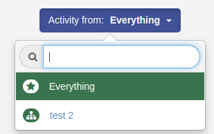
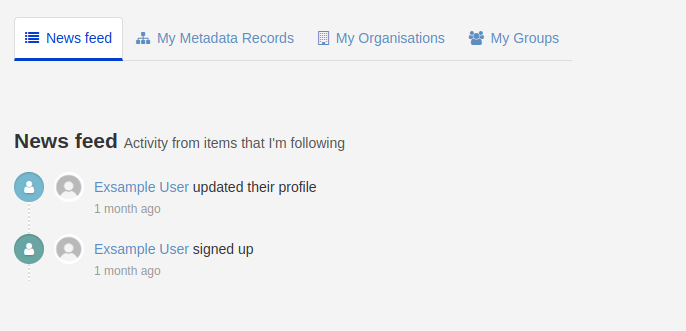
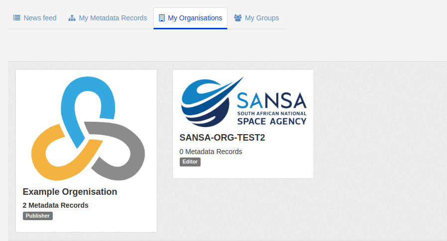
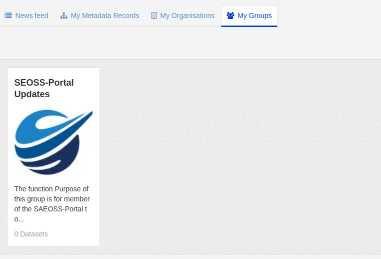
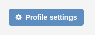

###### The previous chapter to this is the [Home Page](./home.md)

# Dashboard Page
 Once a user has logged-in the dashboard page will be displayed. THis is a central notification hub for communications from the SAEOSS-Portal platform. 

 

 The dashboard is broken into 4 main sections, namely:
   
   1. News Feed: The news feed provides a user with all the recent activity of the groups and orgenisations they follow. 
   2. My Metadata Records: Displayes the all the metadata uploaded by the user. 
   3. My Organisation: Displays all metadat the user forms part of
   4. My Groups: Displays oll the groups the user forms part of

#### Activity Button
The activity button allows you to filter the activity by orgenisation, group or dataset. THis allows you to see individual activity of spesific topics interested. 

### News Feed:
News feed provides an overview of all recent activities of groups orgenisations or metadata you follow. THis allows a user who is interested in a spesific dataset / orgenisation / group to be up to date wth any new changes or assets to the system. Users can follow a group / orgenisation / metadata dataset to receive these notifications. Lean more here: [Following datasets/groups/orgenisations](./metdata.md#following-datasets)

### My Metadata Records

This is a collection of all metadata records that you published. <confirm the vadility of this> 

### My Orgenisations

In this tab a list of all orgenisation you have been added to. Administrators can add you to an orgenisation or you can be added to multiple orgenisations. THis allows you to be able to see any private metadata records for each individual orgenisation.
  

#### What is an orgenisation

### My Groups

This tab displayes all the groups you are part of. You can be added to a single group or multiple groups.

#### What is an group?

### Profile Settings
By selecting the `Profile Settings` button you can adjust your profile settings like your username, bio, password, change profile picture and generate API Keys. This page is explaied in detail here: [Profile Settings](./profile_settings.md)

###### Next Chapter
In the next chapter look at [Profile Settings](./profilesettings.md)