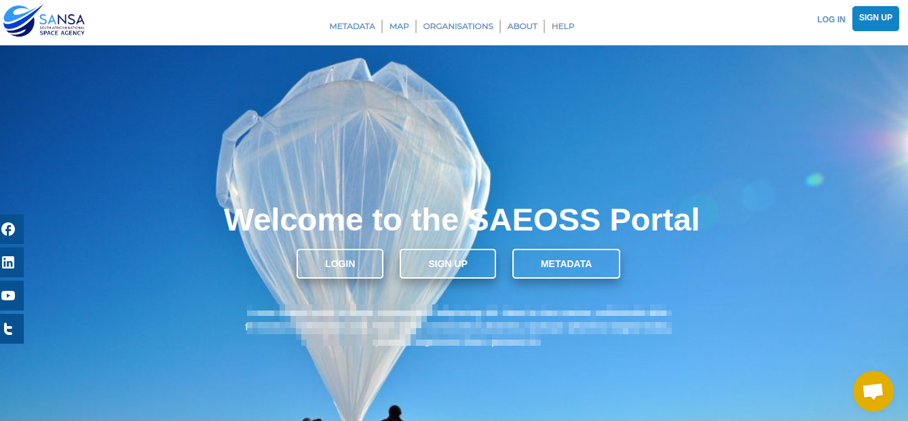
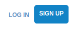
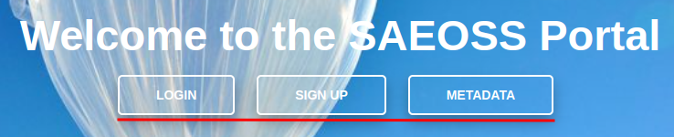
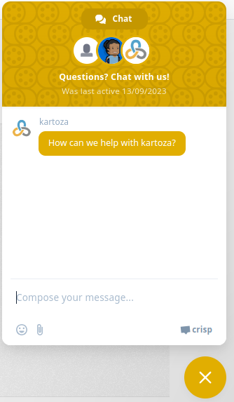
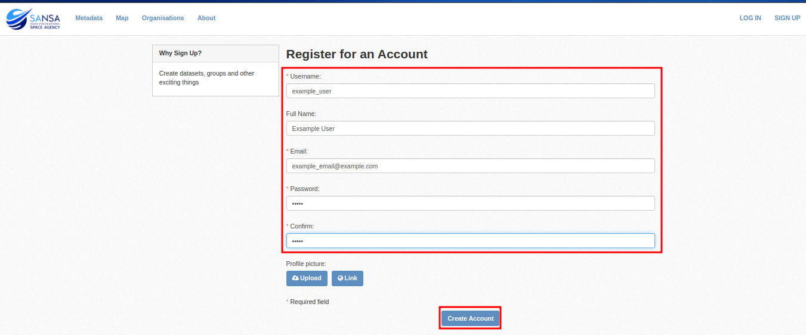
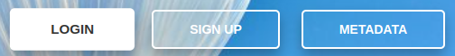
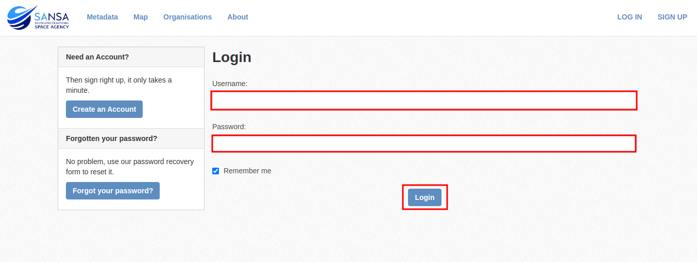
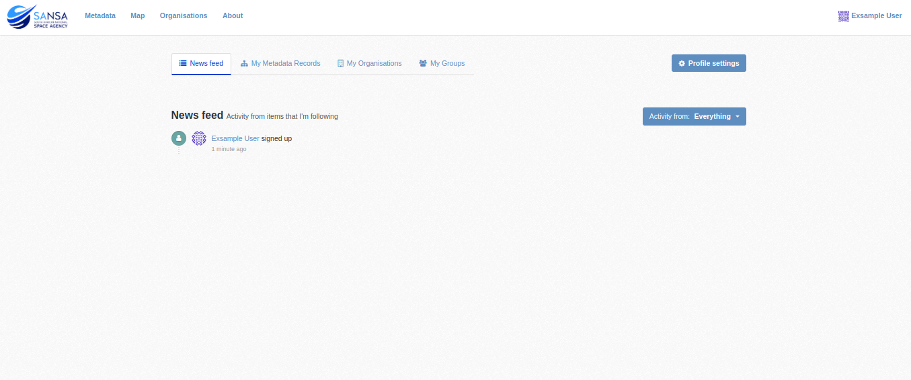

###### Previous: [Introduction](./index.md)

# Home Page
When first accessing the SAEOSS-Portal the home page is displayed. From the home page users are able to [create an account](), [login]() or view metadata.

User are able to view any public metadata on the platform without the need to login. Without an account user are not able to be affiliated with any orgenisation or group and will not be able to see any private data of that group or receive any notifications from the platform. 

### Navigation
From the home page there are many ways to navigate to various pages on the platform. These navigational links can be summarised into the following: 

| Link              | Image                               | Explanation                                                                                          |
| ----------------- | --------------------------------    | ---------------------------------------------------------------------------------------------------- |
| Home Page         |    | By clicking on the SANSA logo from anywhere on the platform the home page will be displayed          |
| Login / SignUp    | | By selecting the login / signup button in the top right corner user can login or create an account.  |
| Social Media Links|      | Various social mdia pages for SANSA can be accessed through the social media links on thr left. |
| Navbar / Navlinks / Navcards | | The navpane allows for easy access to all main pages of the platform.                                |

### Chrisp interface
> **Note:** *This interface send emails to the administrator nad might yield a long turn around time*

The crisp chat interface allows yout to directly contact administrators of the platform should you need assistance you with a proble not listed in the documentation.

|   |   |
 --- | --- |
|  |  |

## Workflows
### Signup
USer who wichs to create an user account can do so by following these steps:

1. From the home screen select one of the signup buttons:
   
   
   
   or

   

2. Complete the signup for with all the relevant details. 
   > **NOTE:** *Fields Marked with an `*` are mandatory fields and cannot be left blank.*
   
   

   > **NOTE:** *Your password shoul conatin at leas `8` characters.*

### Login
Oce a user account has been created users can log in to the platform by following these steps:

1. From the home screen select one of the following login buttons:

    
    
    or
    
    

2. Complete the login form ans click on login
   
   

3. When the dashboard is displayed you have successfully logged-in. 
   
   

###### Next: [Dashboard](./dashboard.md)
