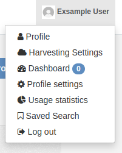
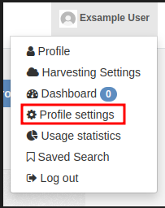
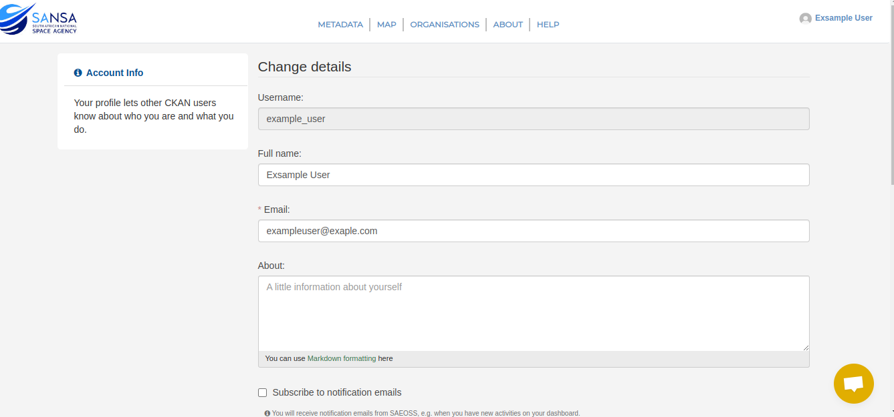
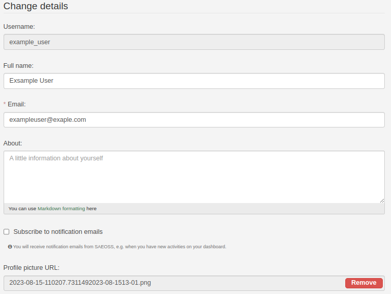
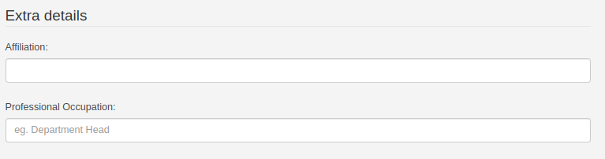
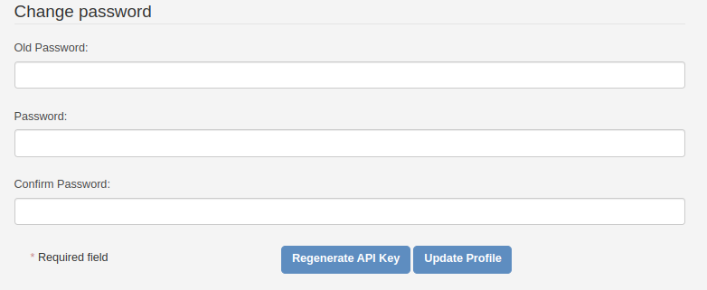

###### Previous Page: [Dashboard](./dashboard.md)

# Profile Settings
On the profile settings page, all user profile related settings can be managed. This page an be accesed by clicking on the `Profile Settings` button in the dashboard page or from anywhere on the platform by following the steps below:

 1. In the top righthand corener click on your user profile name.
   
   

 2. Select Profile settings from the popup menu.
   
   

 3. The profile settings page will now be displayed. 
   
   
   
### Key Elements
The profile settings page consists is broken onto 3 main sections each consisting of key elements:

- **Change details:** User can change public details. This refers to username email and about. All of this information will be in the public domain and other users of the platform will be able to see this information.
  

- **Extra details:** Users can add extra details  like affiliations and professional occupations. 
  

- **Change Password:** Users can change their password from this section if required. 
  

- **Generate API Key** Redirects to the profile API tokens page. To learn more about API token follow this link. [Read more](./profile_page.md#api-tokens)

###### Next Page [Profile Page](./profile_page.md)